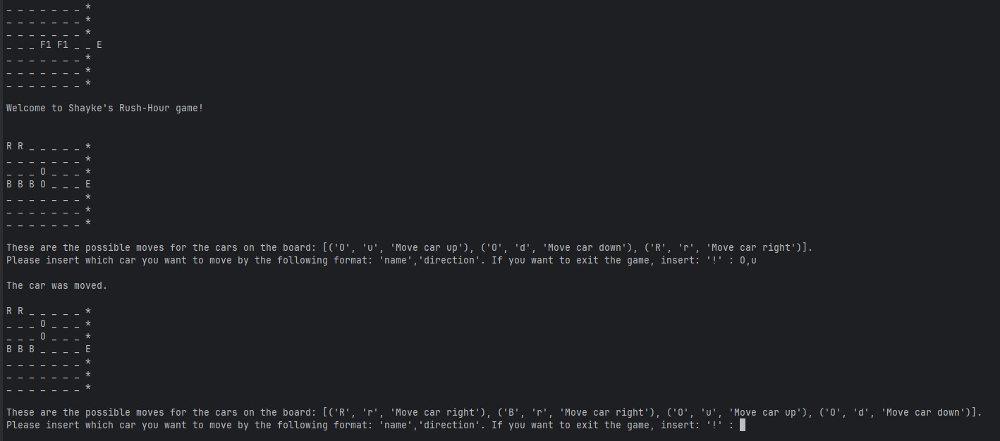

  <h1 align="center" style="border-bottom: none"><b>Exercise 9</b> - Rush Hour</h1>

  

<b>Object-Oriented Programming – Rush Hour</b> is the ninth assignment I completed in the <b>Introduction to Computer Science</b> course at HUJI.
 
In this task, I implemented a simplified version of the classic puzzle game <b>Rush Hour</b>, using principles of <b>object-oriented design</b>. The goal is to help the red car escape a gridlocked 7×7 board by moving other cars out of the way and clearing a path to the exit point at coordinate <code>(3,7)</code>.
 
The exercise emphasizes proper class structure, encapsulation, and clean interface design, with a focus on modeling the board, vehicles, and move logic using Python classes.
  
    <a href="https://github.com/ShayMorad/Intro-To-CS"><strong>« Return to Main Repository</strong></a>
     
  

 

  <h2 align="left" style="border-bottom: 1px solid gray">Running the Project</h2>

  
To try it out locally, follow these steps:

  <ol align="left">
    <li>Clone the repository: <code>git clone &lt;url&gt;</code></li>
    <li>Open the folder in your preferred code editor</li>
    <li><i>Optional:</i> Set up a virtual environment using <code>python3 -m venv venv</code></li>
    <li>Install dependencies: <code>pip install -r requirements.txt</code></li>
    <li>Run the script with: <code>python3 &lt;filename&gt; &lt;car config json file&gt;</code></li>
  </ol>

 

  <h2 align="left" style="border-bottom: 1px solid gray">Media</h2>

  

    
  

 

  <h2 align="left" style="border-bottom: 1px solid gray">Contributions</h2>

  

    Contributions are encouraged! For any significant changes, it's best to open an issue first and start a discussion.
  

 

  <h2 align="left" style="border-bottom: 1px solid gray">License</h2>

  

    This project is licensed under the <a href="https://choosealicense.com/licenses/mit/">MIT License</a>.
  

