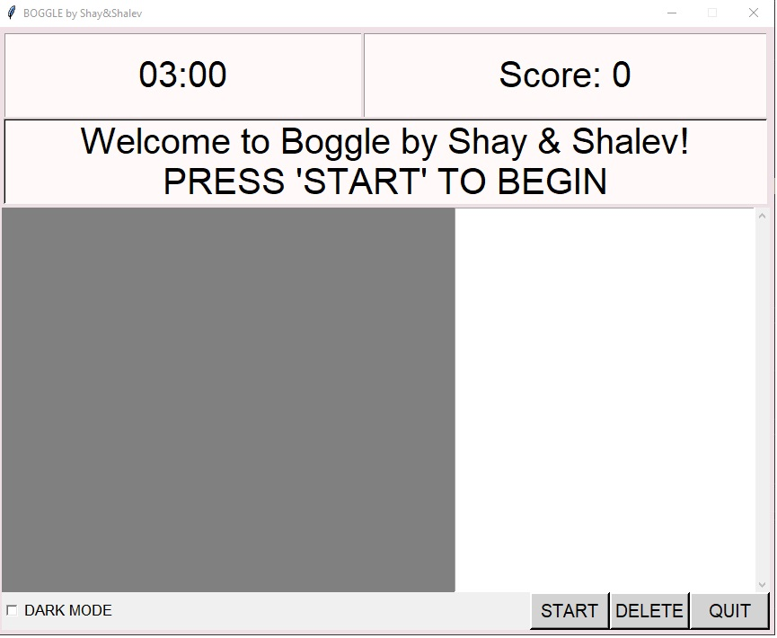
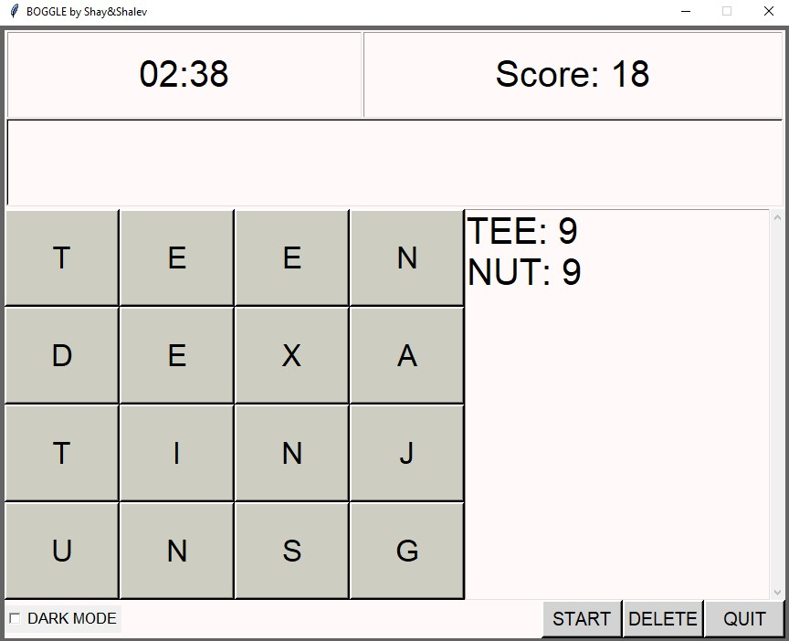
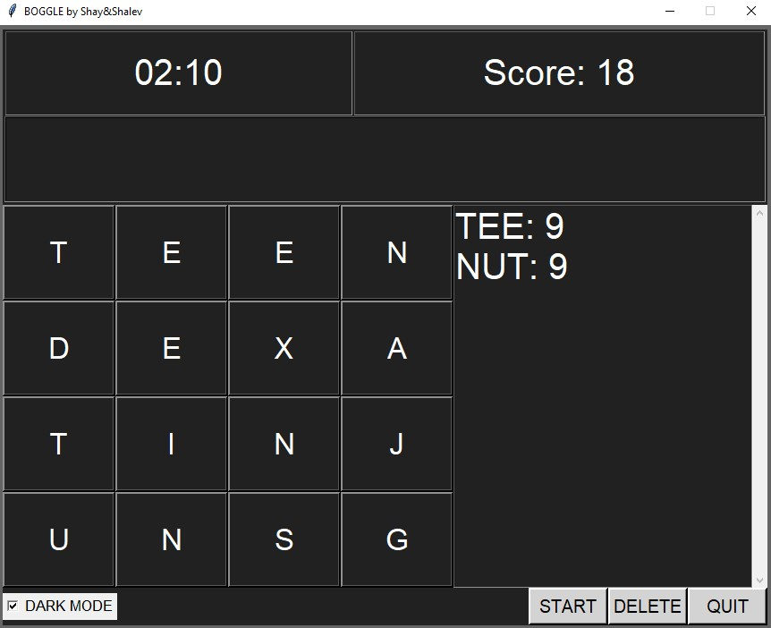
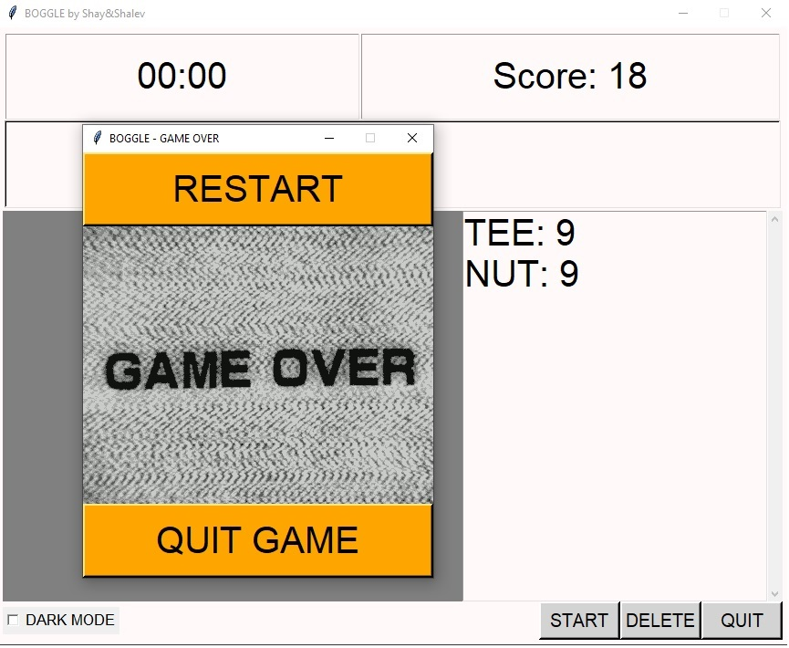

  <h1 align="center" style="border-bottom: none"><b>Exercise 11</b> - Boggle</h1>

  

<b>Boggle</b> is the eleventh and final project in the <b>Introduction to Computer Science</b> course at HUJI.
 
In this extended assignment, we implemented a full-featured version of the word-finding game <b>Boggle</b>, including both the game logic and a graphical user interface using <b>tkinter</b>.
 
The project consists of several core functions for validating paths, generating words of a given length, and computing optimal scoring paths on a randomized 4×4 board. Players can form words by selecting adjacent letters within a 3-minute time limit, aiming to maximize their score based on the length of each word.
 
The assignment emphasized modular design, separation of logic from UI, efficient pathfinding, and careful use of recursion and search techniques. A visual interface was built to enable intuitive gameplay, real-time score tracking, and replay functionality.
      
    <a href="https://github.com/ShayMorad/Intro-To-CS"><strong>« Return to Main Repository</strong></a>
     
  

 

  <h2 align="left" style="border-bottom: 1px solid gray">Features</h2>
  <ol align="left">
    <li>Dark Mode - Switch the colors theme of the game using a check box button.</li>
    <li>Scrollbar - An option to scroll the text label according to the amount of found words.</li>
    <li>Delete - An option to delete pressed buttons by order of press history.</li>
    <li>Restart Window - Pop-up window with a nice GIF, includes restart and quit buttons.</li>
    <li>Buttons colors while pressed - Different colors for each mouse gesture.</li>
    <li>Can get higher score for longer word path - If the user found a word by path of length 'x', and later on found the same word but with a longer path of length 'y' (y>x), the score will update according to the new, longer path.</li>
    <li>Show score for each word - Each word the user found shows on the right with its respective score contribution.</li>
    <li>Modular - can choose buttons amount(whole roots numbers).</li>
    <li>Division to classes - compact and easy to change classes.</li>
  </ol>

 

  <h2 align="left" style="border-bottom: 1px solid gray">Running the Project</h2>

  
To try it out locally, follow these steps:

  <ol align="left">
    <li>Clone the repository: <code>git clone &lt;url&gt;</code></li>
    <li>Open the folder in your preferred code editor</li>
    <li><i>Optional:</i> Set up a virtual environment using <code>python3 -m venv venv</code></li>
    <li>Install dependencies: <code>pip install -r requirements.txt</code></li>
    <li>Run the script with: <code>python3 &lt;filename&gt;</code></li>
  </ol>

 

  <h2 align="left" style="border-bottom: 1px solid gray">Media</h2>

  

    
    

    
      

    
        

    
  

 

  <h2 align="left" style="border-bottom: 1px solid gray">Contributions</h2>

  

    Contributions are encouraged! For any significant changes, it's best to open an issue first and start a discussion.
  

 

  <h2 align="left" style="border-bottom: 1px solid gray">License</h2>

  

    This project is licensed under the <a href="https://choosealicense.com/licenses/mit/">MIT License</a>.
  

